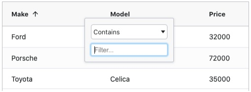
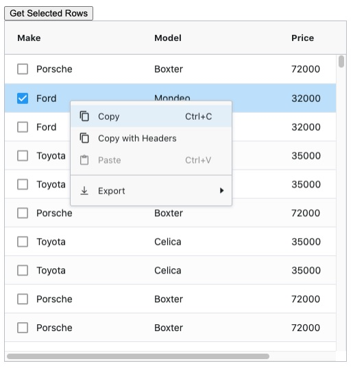

# 📖 AG-Grid

https://www.ag-grid.com/

공식문서와 타 블로그 정리글들을 보면서 정리해 볼 예정

이번 글은 공식문서 튜토리얼 페이지를 보고 정리.


**AG-Grid**

자바스크립트 기반 오픈 소스 그리드.

무료와 상용이 구분되있는데 무료도 왠만한 기능을 지원하고, 상용의 경우 서버사이드랜더링, 엑셀추출, Tree등 지원함.


## 🌏 Add AG Grid

```shell
npm install -g @vue/cli
vue create my-project
```

선택할 옵션

* Choose Vue version
* Babel
* CSS Pre-processors (Sass/SCSS - with node-sass)
* 구성데이터를 저장할 위치 In dedicated config files


AG Grid NPM 패키지 추가

```shell
npm install ag-grid-vue3 ag-grid-community vue-class-component@next
```


App.vue

```vue
...
<style lang="scss">
  @import "ag-grid-community/dist/styles/ag-grid.css";
  @import "ag-grid-community/dist/styles/ag-theme-alpine.css";
</style>
```

만들어진 내 프로젝트의 App.vue에서 style부분을 다음과같이 수정.

ag-grid.css : 그리드 구조 스타일 시트

theme중 하나인 ag-theme-alpine.css를 가져옴.


### 👉 테마의 종류

* ag-theme-alpine : 모던한 스타일, 높은 contrast, 일반적인 padding값이 적용됨.
* ag-theme-apline-dark : alpine의 dark버전
* ag-theme-balham : alpine보다 그리드 간격과 폰트가 좀더 작고 촘촘합니다. 데이터를 좀더 많이 보여줌.
* ag-theme-balham-dark : balham의 dark버전
* ag-theme-material : 구글의 material 디자인 스타일. 적은양의 데이터를 여유있게 보여줄 때 유용.


## 🌏 Example Code 

데이터를 출력하는데 중요한 것은 **rowData와 columDefs**.<br/>

(AG Grid API와 GridOptions등도 중요하다! 추후에 다룰예정)

columDefs는 열속성을, rowData는 출력될 데이터들.


### 👉 시작하기

```vue
<template>
    <ag-grid-vue style="width: 500px; height: 500px;"
        class="ag-theme-alpine"
        :columnDefs="columnDefs"
        :rowData="rowData">
    </ag-grid-vue>
</template>
```

**rowData와 columDefs** 이 두가지 속성을 바인딩하여 AG-그리드 구성 요소 정의 .


```vue
<script>
    import { AgGridVue } from "ag-grid-vue3";

    export default {
        name: 'App',
        data() {
            return {
                columnDefs: null,
                rowData: null
            }
        },
        components: {
            AgGridVue
        },
        beforeMount() {
            this.columnDefs = [
                { field: 'make' },
                { field: 'model' },
                { field: 'price' }
            ];

            this.rowData = [
                { make: 'Toyota', model: 'Celica', price: 35000 },
                { make: 'Ford', model: 'Mondeo', price: 32000 },
                { make: 'Porsche', model: 'Boxter', price: 72000 }
            ];
        }
    }
</script>
```

이렇게 하면 어떻게 될까?

colum으로 make, model, pice를 가지고,<br/>rowData에 make값은 'Toyota', model값은 'Celica', price는 35000 ... 해서 3가지 데이터가 아래처럼 나올것이다.

|  Make   | Model  | Price |
| :-----: | :----: | :---: |
| Toyota  | Celica | 35000 |
|  Ford   | Mondeo | 32000 |
| Porsche | Boxter | 72000 |


### 👉 정렬 및 필터링

**정렬**을 하고싶다면? =>  **sortable속성**을 true로 설정하면된다.

```vue
this.columnDefs = [
	{ field: 'make', sortable: true },
    { field: 'model', sortable: true },
    { field: 'price', sortable: true }
]
```

헤더를 클릭하면 오름차순, 내림차순 및 정렬 안함을 전환함.


데이터가 많아지게 되면 특정 데이터를 찾기 어려워진다 => 필터링이 필요하다.<br/>이 경우 **filter속성을 true로** 하여 **필터링을 활성화** 시킨다. 




### 👉 원격 데이터 가져오기

원격 서버에서 데이터를 가져와보자.

```vue
beforeMount() {
    this.columnDefs = [
        { field: 'make' },
        { field: 'model' },
        { field: 'price' }
    ];

    fetch('https://www.ag-grid.com/example-assets/small-row-data.json')
        .then(result => result.json())
        .then(rowData => this.rowData = rowData);
}
```

해당 주소에서 가져온 데이터를 rowData에 넣어준다.

(예제는 fetch를 이용했지만 나의 경우엔 axios를 이용해 가져올 예정)


### 👉 선택 활성화

그리드에서 특정 행을 선택하고, 시스템에서 플래그가 지정된 것으로 표시하도록 허용해야함.

#### 전체 코드

```vue
<template>
    <ag-grid-vue style="width: 500px; height: 500px;"
        class="ag-theme-alpine"
        :columnDefs="columnDefs"
        :rowData="rowData"
        rowSelection="multiple">
    </ag-grid-vue>
</template>
```

```vue
<script>
import {AgGridVue} from "ag-grid-vue3";

export default {
   name: 'App',
   data() {
       return {
           columnDefs: null,
           rowData: null,
           gridApi: null,
           columnApi: null
       }
   },
   components: {
       AgGridVue
   },
   beforeMount() {
       this.columnDefs = [
           {field: 'make', sortable: true, filter: true, checkboxSelection: true},
           {field: 'model', sortable: true, filter: true},
           {field: 'price', sortable: true, filter: true}
       ];

       fetch('https://www.ag-grid.com/example-assets/small-row-data.json')
               .then(result => result.json())
               .then(rowData => this.rowData = rowData);
   }
}
</script>

<style lang="scss">
@import "ag-grid-community/dist/styles/ag-grid.css";
@import "ag-grid-community/dist/styles/ag-theme-alpine.css";
</style>
```


#### 살펴 보자

```vue
<template>
	<ag-grid-vue style="width: 500px; height: 500px;"
        ...
        rowSelection="multiple">
    </ag-grid-vue>
</template>
```

rowSelection을 multipe로 주어 여러 행 선택을 활성화.

```vue
beforeMount(){
	this.columnDefs = [
		{field: 'make', sortable: true, filter: true, checkboxSelection: true},
		{field: 'model', sortable: true, filter: true},
		{field: 'price', sortable: true, filter: true}
	]
}
```

'make' field를 보면 checkboxSelection을 true로 하였습니다.

이를 통해 make앞에 체크박스가 생긴걸 볼 수 있습니다.


### 👉 선택된 데이터를 가져와 서버로 보내기

AG Grid API를 사용

gridReady이벤트에 그리드 및 열 API 모두에 대한 참조를 저장함.

#### 전체 코드 

```vue
<template>
    <div>
        <button @click="getSelectedRows()">Get Selected Rows</button>

        <ag-grid-vue style="width: 500px; height: 500px;"
            class="ag-theme-alpine"
            :columnDefs="columnDefs"
            :rowData="rowData"
            rowSelection="multiple"
            @grid-ready="onGridReady">
        </ag-grid-vue>
    </div>
</template>
<script>
    import { AgGridVue } from "ag-grid-vue3";

    export default {
        name: 'App',
        data() {
            return {
                columnDefs: null,
                rowData: null
                gridApi: null,
                columnApi: null
            }
        },
        components: {
            AgGridVue
        },
        methods: {
            onGridReady(params) {
                this.gridApi = params.api;
                this.columnApi = params.columnApi;
            },
            getSelectedRows() {
                const selectedNodes = this.gridApi.getSelectedNodes();
                const selectedData = selectedNodes.map( node => node.data );
                const selectedDataStringPresentation = selectedData.map( node => `${node.make} ${node.model}`).join(', ');
                alert(`Selected nodes: ${selectedDataStringPresentation}`);
            }
        },
        beforeMount() {
            this.columnDefs = [
                { field: 'make', checkboxSelection: true },
                { field: 'model' },
                { field: 'price' }
            ];

            fetch('https://www.ag-grid.com/example-assets/small-row-data.json')
                .then(result => result.json())
                .then(rowData => this.rowData = rowData);
        }
    }
</script>

<style lang="scss">
...
</style>
```


#### 살펴 보자

```vue
<template>
    <div>
        <button @click="getSelectedRows()">Get Selected Rows</button>

        <ag-grid-vue style="width: 500px; height: 500px;"
            class="ag-theme-alpine"
            :columnDefs="columnDefs"
            :rowData="rowData"
            rowSelection="multiple"
            @grid-ready="onGridReady">
        </ag-grid-vue>
    </div>
</template>
```

위 버튼은 선택도니 데이터를 가져와 서버로 보내는 버튼.

`gridReady`이벤트 에 그리드 및 열 API 모두에 대한 참조를 저장함.

```vue
...
<script>
...
methods: {
    onGridReady(params) {
        this.gridApi = params.api;
        this.columnApi = params.columnApi;
    },
    getSelectedRows() {
        const selectedNodes = this.gridApi.getSelectedNodes();
        const selectedData = selectedNodes.map( node => node.data );
        const selectedDataStringPresentation = selectedData.map( node => `${node.make} ${node.model}`).join(', ');
        alert(`Selected nodes: ${selectedDataStringPresentation}`);
    }
},
</script>
```

여기서 사용된 api는 getSelectedNodes다.<br/>**getSelectedNodes** : 선택한 노드목록을 반환함. 데이터가 아닌 기본 노드를 가져오는 것은 노드를 순회할 수 있으므로 트리/집계 데이터로 작업할 때 유용합니다.

> 1.버튼을 클릭하게 되면 getSelectedRows 메소드가 실행되고, 여기서 getSelectedNodes()메소드로 선택한 노드목록을 반환한다.<br/>2.선택된 노드의 data들을 map을이용하여 새로운 배열로 만들어 selectedData에 저장.<br/>3.하나의 스트링으로 만들어서 `selectedDataStringPresentation`에 저장.<br/>형태는 join으로 콤마를 기준으로 연결하여 `make값 model값, make값 model값, ...`
>
> 
>
> [
>
>  { make: 'Toyota', model: 'Celica', price: 35000 },
>
>  { make: 'Ford', model: 'Mondeo', price: 32000 },
>
>  { make: 'Porsche', model: 'Boxter', price: 72000 }
>
> ] << 이 배열이
>
> 아래처럼 변경됨.
>
> Toyota Celica, Ford Mondeo, Porsche Boxter

❗ 예제에서 다룬 코드는 간략하게 보기위해 backend와 통신하는게 아닌 alert를 출력하여서 확인함.


### 👉 그룹화

❗ 그룹화는 **AG Grid Enterprise 전용 기능**. 주의!

사용자가 많은 양의 데이터를 이해하는데 효과적임.

```vue
// fetch('https://www.ag-grid.com/example-assets/small-row-data.json')
fetch('https://www.ag-grid.com/example-assets/row-data.json')
```

기존 fetch url을 변경하여 더 큰 데이터 set을 얻어옴.


ag-grid의 엔터프라이즈 기능을 활성화.<br/>추가 패키지 설치

```shell
npm install --save ag-grid-enterprise
```


#### main.js

```javascript
import Vue from 'vue';
import 'ag-grid-enterprise';
import App from './App';
```


애플리케이션을 다시시작하면 console에 라이센스 키가 없다는 메시지가 표시되어야함.

사용자지정 컨텍스트 메뉴와 더 멋진 열 메뉴 팝업이 있음.




그룹화를 활성화해보자!

#### 전체 코드

```vue
<template>
    <div>
        <button @click="getSelectedRows()">Get Selected Rows</button>
        <ag-grid-vue style="width: 500px; height: 500px;"
            class="ag-theme-alpine"
            :columnDefs="columnDefs"
            :rowData="rowData"
            :autoGroupColumnDef="autoGroupColumnDef"
            rowSelection="multiple"
            @grid-ready="onGridReady">
        </ag-grid-vue>
    </div>
</template>
```

```vue
<script>
    import { AgGridVue } from "ag-grid-vue3";

    export default {
        name: 'App',
        data() {
            return {
                columnDefs: null,
                rowData: null,
                gridApi: null,
                columnApi: null,
                autoGroupColumnDef: null
            }
        },
        components: {
            AgGridVue
        },
        methods: {
            onGridReady(params) {
                this.gridApi = params.api;
                this.columnApi = params.columnApi;
            },
            getSelectedRows() {
                const selectedNodes = this.gridApi.getSelectedNodes();
                const selectedData = selectedNodes.map(node => node.data);
                const selectedDataStringPresentation = selectedData.map(node => `${node.make} ${node.model}`).join(', ');
                alert(`Selected nodes: ${selectedDataStringPresentation}`);
            }
        },
        beforeMount() {
            this.columnDefs = [
                { field: 'make', rowGroup: true },
                { field: 'model' },
                { field: 'price' }
            ];

            this.autoGroupColumnDef = {
                headerName: 'Model',
                field: 'model',
                cellRenderer: 'agGroupCellRenderer',
                cellRendererParams: {
                    checkbox: true
                }
            };

            fetch('https://www.ag-grid.com/example-assets/small-row-data.json')
                .then(result => result.json())
                .then(rowData => this.rowData = rowData);
        }
    }
</script>

<style></style>
```


#### 살펴 보자

```vue
<template>
    <div>
        <button @click="getSelectedRows()">Get Selected Rows</button>
        <ag-grid-vue style="width: 500px; height: 500px;"
            class="ag-theme-alpine"
            :columnDefs="columnDefs"
            :rowData="rowData"
            :autoGroupColumnDef="autoGroupColumnDef"
            rowSelection="multiple"
            @grid-ready="onGridReady">
        </ag-grid-vue>
    </div>
</template>
<script>
...
 beforeMount() {
    this.columnDefs = [
        { field: 'make', rowGroup: true },
        { field: 'model' },
        { field: 'price' }
    ];

    this.autoGroupColumnDef = {
        headerName: 'Model',
        field: 'model',
        cellRenderer: 'agGroupCellRenderer',
        cellRendererParams: {
            checkbox: true
        }
    };

  ...
}
...
</script>
```

autoGroupColumnDef속성을 추가하고, columnDefs에 rowGroup을 update!

grid는 이제 make로 그룹화하고,  model확장 시 필드 값을 나열함.

groupSelectionChildren 속성은 그룹의 모든 항목을 선택/선택 해제하는 group-level checkbox를 추가함.

autoGroupColumnDef를 사용하여 columnDefs에서 checkboxSelection을 삭제함.


## 📘 참고

https://www.ag-grid.com/vue-data-grid/vue3/

https://www.ag-grid.com/vue-data-grid/grid-api/

https://eblo.tistory.com/29

https://dong-queue.tistory.com/57