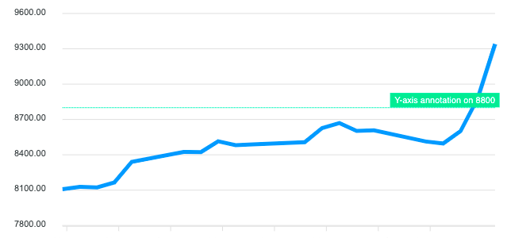
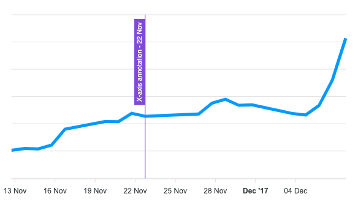

# Annotations

## Annotations

특정 데이터 포인트 또는 축 값에서 사용자 정의 텍스트를 쓸 수 있다.


## Y-axis annotations

수평선과 text를 보여줌.

범위 지정 가능.

```javascript
annotations: {
  yaxis: [
    {
      y: 8800,
      borderColor: '#00E396',
      label: {
        borderColor: '#00E396',
        style: {
          color: '#fff',
          background: '#00E396'
        },
        text: 'Y-axis annotation on 8800'
      }
    }
  ]
}
// -------------------------range --------------------------
yaxis: [
    {
      y: 8600,
      y2: 9000,
      borderColor: '#000',
      fillColor: '#FEB019',
      label: {
        text: 'Y-axis range'
      }
    }
  ]
```




## X-axis annotations

세로 선과 text를 보여줌.

range지정 가능

```javascript
annotations: {
  xaxis: [
    {
      x: new Date('23 Nov 2017').getTime(),
      borderColor: '#775DD0',
      label: {
        style: {
          color: '#fff',
        },
        text: 'X-axis annotation - 22 Nov'
      }
    }
  ]
}
// -------------------------range --------------------------
xaxis: [
    {
      x: 'Oct 06',
      borderColor: '#00E396',
      label: {
        borderColor: '#00E396',
        orientation: 'horizontal',
        text: 'X Annotation'
      }
    }
  ]
```




## Point(XY) annotations

```javascript
points: 
[
  {
    x: new Date('01 Dec 2017').getTime(),
    y: 8607.55,
    marker: {
      size: 8,
    },
    label: {
      borderColor: '#FF4560',
      text: 'Point Annotation'
    }
  }
]
```