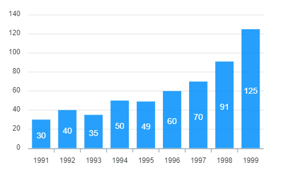

# ApexCharts.js

Modern & Interactive Open-source Charts about Vue

Version 1.4.1 (2022.04.23기준)

* MIT에서 라이선스를 받은 오픈 소스 프로젝트이며 상용 애플리케이션에서 무료로 사용가능

* use Ignite UI Grids <br/>사용자 지정 템플릿 및 실시간 데이터 업데이트에 대한 액세스를 제공하며 데이터 행과 열을 무제한으로 처리 가능

* 최소한의 코딩으로 데이터에 빠르게 바인딩
* 대부분의 프레임워크에서 사용 가능.<br/>Angular, React, Blazor, Jquery, ...
* 대시보드 템플릿도 존재.


## Installation

### npm 

```shell
npm install --save apexcharts
npm install --save vue3-apexcharts
```

### Usage

```vue
import VueApexCharts from "vue3-apexcharts";

const app = createApp(App);
app.use(VueApexCharts);
// The app.use(VueApexCharts) will make <apexchart> component available everywhere.
```

or

```vue
// you can import in a particular component and register the component like below
import VueApexCharts from "vue3-apexcharts";
export default {
  components: {
    apexchart: VueApexCharts,
  },
};
```

**provide $apexcharts**


## Example

basic barchart with minimal configuration

```vue
<template>
  <div>
    <apexchart
      width="500"
      type="bar"
      :options="chartOptions"
      :series="series"
    ></apexchart>
  </div>
</template>
<script>
export default {
  data: function() {
    return {
      chartOptions: {
        chart: {
          id: "vuechart-example",
        },
        xaxis: {
          categories: [1991, 1992, 1993, 1994, 1995, 1996, 1997, 1998],
        },
      },
      series: [
        {
          name: "series-1",
          data: [30, 40, 35, 50, 49, 60, 70, 91],
        },
      ],
    };
  },
};
</script>
```




### How Update Chart?

series나 option을 변경하면 자동으로 차트를 다시 그린다.

> ❗ 주의 Important!!!!
>
> 옵션을 업데이트 하는 동안 중첩 속성을 업데이트 해야하는 경우에도 가장 바깥쪽 속성을 업데이트 해야한다.
>
> ✅ Do this
>
> ```vue
> this.chartOptions = {
>   ...this.chartOptions,
>   ...{
>     xaxis: {
>       labels: {
>         style: {
>           colors: ["red"],
>         },
>       },
>     },
>   },
> };
> ```
>
> ❌ Not this
>
> ```vue
> this.chartOptions.xaxis = {
>     labels: {
>         style: {
>           colors: ['red']
>         }
>     }
> }}
> ```


## 차트를 참조하지않고 ApexCharts 의 methods를 부르는 방법

`window.ApexCharts`로 전역변수를 직접 부를 수 있다.

chart.id로 차트를 대상으로 지정해야한다.

```vue
window.ApexCharts.exec("vuechart-example", "updateSeries", [
  {
    data: [40, 55, 65, 11, 23, 44, 54, 33],
  },
]);
```

id가 vuechart-example.

호출하는 메서드가 updateSeries

그 뒤의 배열이 업데이트하려는 시리즈. docs에서 exec확인.


[apexcharts.com](https://apexcharts.com/)

[Ignite UI](https://www.infragistics.com/products/ignite-ui)

[npm vue3-apexcharts](https://www.npmjs.com/package/vue3-apexcharts)

[methods exec](https://apexcharts.com/docs/methods/#exec)