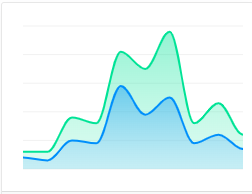

## ApexChart 종류

(Demo 기준)

현재 지정된 차트 형태는 **Line, Scatter, mixed**

* **Line** 
* Area 
* Column 
* Bar 
* **Mixed** 
* TimeLine 
* Candlestick 
* BoxPlot 
* Bubble 
* **Scatter** 
* HeatMap 
* Treemap 
* Pie 
* RadiaBar 
* Radar 
* Polar Area 
* DashBoards 

[vue-chart-demo](https://apexcharts.com/vue-chart-demos/)

