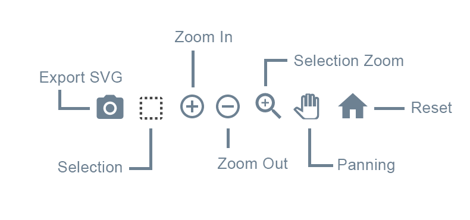

# Interactivity(Zoom, Scroll, Pan)

차트와 상호작용하는 요소들

`chart.toolbar`와 `chart.zoom`을 참고.

[chart.toolbar](https://apexcharts.com/docs/options/chart/toolbar/)

[chart.zoom](https://apexcharts.com/docs/options/chart/zoom/)