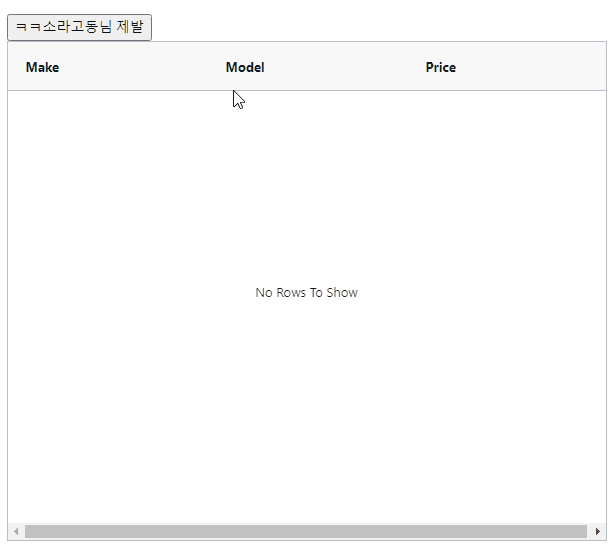
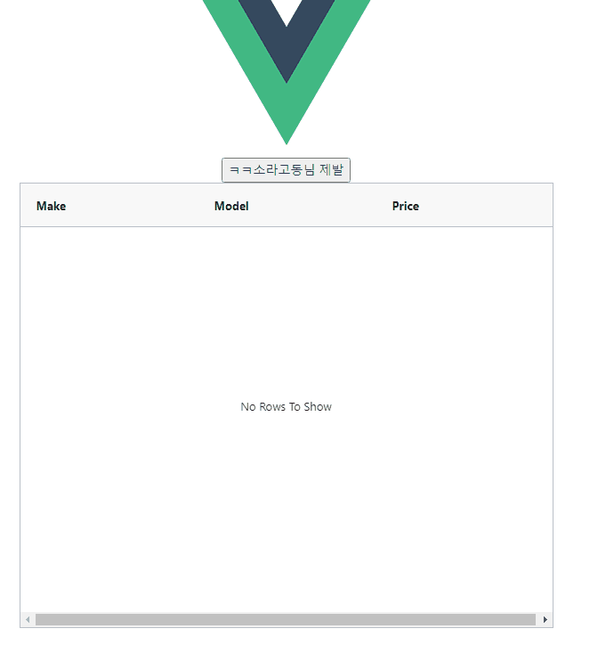

# quasar 



```json
"dependencies": {
    "@quasar/extras": "^1.0.0",
    "ag-grid-community": "26.2.0",
    "ag-grid-vue3": "26.2.0",
    "core-js": "^3.6.5",
    "quasar": "^2.0.0",
    "vue": "^3.0.0",
    "vue-class-component": "^8.0.0-rc.1",
    "vue-router": "^4.0.0"
  },
  
```


## INDEX.vue

```vue
<template>
  <q-page class="flex flex-center">
    
    <div style="width: 600px; height: 600px; margin: 0 auto">
      <button @click="setRowData">ㅋㅋ소라고동님 제발</button>
      <div>
        <ag-grid ref="meta"></ag-grid>
      </div>
    </div>
  </q-page>
</template>

<script>
import { defineComponent } from "vue";
import { ref, onMounted } from "vue";
import AgGrid from "./../components/AgGrid.vue";
export default defineComponent({
  name: "PageIndex",
  components: { AgGrid },
  setup() {
    const meta = ref(null);
    const columnDefs = ref([]);
    const rowData = ref([]);

    const setRowData = () => {
      meta.value.rowData = [
        { make: "Toyota", model: "Celica", price: 35000 },
        { make: "Ford", model: "Mondeo", price: 32000 },
        { make: "Porsche", model: "Boxter", price: 72000 },
      ];
    };

    const setColumnDefs = () => {
      meta.value.columnDefs = [
        { headerName: "Make", field: "make" },
        { headerName: "Model", field: "model" },
        { headerName: "Price", field: "price" },
      ];
    };
    onMounted(() => {
      console.log(meta.value);
      setColumnDefs();
    });

    return {
      meta,
      rowData,
      columnDefs,

      setRowData,
    };
  },
});
</script>

```


## AgGrid



```vue
<template>
  <ag-grid-vue style="width: 600px; height: 500px;"
    class="ag-theme-alpine"
    :columnDefs="columnDefs"
    :rowData="rowData"
    :gridOptions = "gridOptions"
    @gridReady="handleGridReady"
    >
  </ag-grid-vue>
</template>

<script>
import {ref} from 'vue';
import "ag-grid-community/dist/styles/ag-grid.css";
import "ag-grid-community/dist/styles/ag-theme-alpine.css";
import { AgGridVue } from "ag-grid-vue3";
import CommonRender from './CommonRender.vue';

export default {
  components:{
    AgGridVue
  },
  props:['agCkb'],
  setup(props, {expose}){
    const gridApi = ref(null);
    const handleGridReady = (event) =>{
      gridApi.value = event.api
    }
    const columnDefs = ref([]);
    const rowData = ref([]);
    const gridOptions = ref({
      defaultColDef:{
        sortable: true,
        cellRendererFramework: CommonRender,
      }
    })
    expose({gridApi, columnDefs, rowData})
    return{
      gridApi, columnDefs, rowData, handleGridReady, gridOptions
    }
  }

}
</script>

<style>

</style>
```


# Vue3

```json
"dependencies": {
    "ag-grid-community": "26.2.0",
    "ag-grid-enterprise": "26.2.0",
    "ag-grid-vue3": "26.2.0",
    "ant-design-vue": "^2.2.8",
    "core-js": "^3.6.5",
    "vue": "^3.0.0",
    "vue-class-component": "^8.0.0-rc.1",
    "vue-property-decorator": "^8.0.0",
    "vue-router": "^4.0.0-0",
    "vue-sidebar-menu": "^5.1.2"
  },
```


## Index.vue

```vue
<template>
  
  <div style="width:600px; height:600px; margin:0 auto">
    <button @click="setRowData">ㅋㅋ소라고동님 제발</button>
    <div>
      <ag-grid ref="meta"></ag-grid>
    </div>
  </div>

</template>
<script>
import {ref, onMounted} from 'vue';
import AgGrid from './components/AgGrid.vue';

export default {
  components:{AgGrid},
  setup() {
    const meta = ref(null);
    const columnDefs = ref([]);
    const rowData = ref([])

    const setRowData = () =>{
      meta.value.rowData = [
        { make: "Toyota", model: "Celica", price: 35000 },
        { make: "Ford", model: "Mondeo", price: 32000 },
        { make: "Porsche", model: "Boxter", price: 72000 },
      ]
    }

    const setColumnDefs = () =>{
      meta.value.columnDefs = [
        { headerName: "Make", field: "make" },
        { headerName: "Model", field: "model" },
        { headerName: "Price", field: "price" },
      ];
    }
    onMounted(()=>{
      console.log(meta.value)
      setColumnDefs();
    })
   
    return {
      meta,
      rowData,
      columnDefs,
      
      setRowData,
    }
  },
}
</script>

<style>
#app {
  font-family: Avenir, Helvetica, Arial, sans-serif;
  -webkit-font-smoothing: antialiased;
  -moz-osx-font-smoothing: grayscale;
  text-align: center;
  color: #2c3e50;
}

#nav {
  padding: 30px;
}

#nav a {
  font-weight: bold;
  color: #2c3e50;
}

#nav a.router-link-exact-active {
  color: #42b983;
}
</style>

```


## AgGrid

```vue
<template>
  <ag-grid-vue style="width: 600px; height: 500px;"
    class="ag-theme-alpine"
    :columnDefs="columnDefs"
    :rowData="rowData"
    :gridOptions = "gridOptions"
    @gridReady="handleGridReady"
    >
  </ag-grid-vue>
</template>

<script>
import {ref} from 'vue';
import "ag-grid-community/dist/styles/ag-grid.css";
import "ag-grid-community/dist/styles/ag-theme-alpine.css";
import { AgGridVue } from "ag-grid-vue3";
import CommonRender from './CommonRender.vue';

export default {
  components:{
    AgGridVue
  },
  props:['agCkb'],
  setup(props, {expose}){
    const gridApi = ref(null);
    const handleGridReady = (event) =>{
      gridApi.value = event.api
    }
    const columnDefs = ref([]);
    const rowData = ref([]);
    const gridOptions = ref({
      defaultColDef:{
        sortable: true,
        cellRendererFramework: CommonRender,
      }
    })
    expose({gridApi, columnDefs, rowData})
    return{
      gridApi, columnDefs, rowData, handleGridReady, gridOptions
    }
  }

}
</script>

<style>

</style>
```

