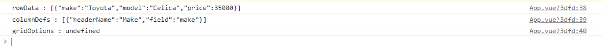

# Template Refs

Vue의 선언적 렌더링 모델은 대부분의 직접 DOM 작업을 추상화하지만 <br/>기본 DOM 요소에 직접 액세스해야 하는 경우가 있을 수 있다.

ref속성을 사용.

```vue
<input ref="input">
```

마운트된 특정 DOM 요소 또는 자식 구성 요소 인스턴스에 대한 직접 참조를 얻을 수 있습니다. 


## Ref on Component

child Component에서도 ref를 사용할 수 있다.

```vue
<script>
import Child from './Child.vue'

export default {
  components: {
    Child
  },
  mounted() {
    // this.$refs.child will hold an instance of <Child />
  }
}
</script>

<template>
  <Child ref="child" />
</template>
```

참조된 인스턴스는 자식 구성요소와 동일.

**❗ 부모 구성 요소는 자식 구성 요소의 모든 속성과 메서드에 대한 전체 엑세스 권한을 가진다.**

부모와 자식 간에 밀접하게 결합된 구현 세부 정보를 쉽게 생성할 수 있으므로 구성 요소 참조는 절대적으로 필요할 때만 사용해야 합니다. 

대부분의 경우 표준 props를 사용하여 부모/자식 상호 작용을 구현하고 인터페이스를 먼저 내보내야 합니다.


## expose

expose옵션을 사용해 자식 인스턴스에 대한 액세스를 제한할 수 있습니다.

```vue
export default {
  expose: ['publicData', 'publicMethod'],
  data() {
    return {
      publicData: 'foo',
      privateData: 'bar'
    }
  },
  methods: {
    publicMethod() {
      /* ... */
    },
    privateMethod() {
      /* ... */
    }
  }
}
```


## Example Code

### App.vue


```vue
<template>
  
  <div style="width:600px; height:600px; margin:0 auto">
    <button @click="setRowData">ㅋㅋ소라고동님 제발</button>
    <div>
      <ag-grid ref="meta"></ag-grid>
    </div>
  </div>

</template>
<script>
import {ref, onMounted} from 'vue';
import AgGrid from './components/AgGrid.vue';

export default {
  components:{AgGrid},
  setup() {
	const meta = ref(null);
    ...
    onMounted(()=>{
      console.log(`rowData : ${JSON.stringify(meta.value.rowData)}`);
      console.log(`columnDefs : ${JSON.stringify(meta.value.columnDefs)}`);
      console.log(`gridOptions : ${meta.value.gridOptions}`);
      setColumnDefs();
    })
   
    return {
      meta,
      rowData,
      columnDefs,
      
      setRowData,
    }
  },
}
</script>

<style>
...
</style>

```


### Default Data

```vue
const gridApi = ref(null);
const columnDefs = ref([{ headerName: "Make", field: "make" }]);
const rowData = ref([{ make: "Toyota", model: "Celica", price: 35000 }]);
const gridOptions = ref({
      defaultColDef:{
        sortable: true,
        cellRendererFramework: CommonRender,
      }
    })
```


### 1. expose none

```vue
setup(){
    ...
    return{
      gridApi, columnDefs, rowData, handleGridReady, gridOptions
    }
  }
```



### 2. expose - rowData

```vue
setup(props, {expose}){
    ...
	expose({rowData})
    return{
      gridApi, columnDefs, rowData, handleGridReady, gridOptions
    }
  }
```


### 3. expose - rowData, columnDefs

```vue
setup(props, {expose}){
    ...
	expose({rowData, columnDefs})
    return{
      gridApi, columnDefs, rowData, handleGridReady, gridOptions
    }
  }
```


## 참고

[vuejs.org](https://vuejs.org/guide/essentials/template-refs.html)