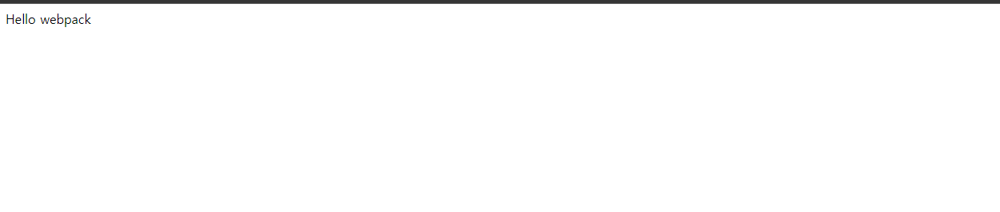

# 웹팩 맛보기

웹팩을 실행할 수 있는 개발 환경을 구성하고, 빌드 과정을 경험.


## 개발 환경 구성

Node.js : 10버전 이상

NPM : 6버전 이상


## 실습 절차 - 웹 페이지 자원 구성

### 1. package.json 파일 생성

```shell
npm init -y
```


생성된 package.json

```json
{
  "name": "practiceRepo",
  "version": "1.0.0",
  "description": "",
  "main": "index.js",
  "scripts": {
    "test": "echo \"Error: no test specified\" && exit 1"
  },
  "keywords": [],
  "author": "",
  "license": "ISC"
}
```


### 2. 웹팩관련 라이브러리와 lodash 설치

```shell
npm i webpack webpack-cli -D
npm i lodash
```


### 3. index.html 생성

```html
<html>
  <head>
    <title>Webpack Demo</title>
    <script src="https://unpkg.com/lodash@4.16.6"></script>
  </head>
  <body>
    <script src="src/index.js"></script>
  </body>
</html>
```


### 4. 루트레벨에 src폴더 생성 후 index.js 생성

```javascript
function component() {
  var element = document.createElement('div');

  /* lodash is required for the next line to work */
  element.innerHTML = _.join(['Hello','webpack'], ' ');

  return element;
}

document.body.appendChild(component());
```


## 실습 절차 - 웹팩 빌드를 위한 구성 및 빌드

### 5. 각 파일에 아래 내용 적용

```javascript
// index.js
import _ from 'lodash';

function component() {
  var element = document.createElement('div');

  /* lodash is required for the next line to work */
  element.innerHTML = _.join(['Hello','webpack'], ' ');

  return element;
}

document.body.appendChild(component());
```


```javascript
<!-- index.html -->
<html>
  <head>
    <title>Webpack Demo</title>
    <!-- <script src="https://unpkg.com/lodash@4.16.6"></script> -->
  </head>
  <body>
    <!-- <script src="src/index.js"></script> -->
    <script src="dist/main.js"></script>
  </body>
</html>
```

index.html에서 script로 가져오던 부분을 주석처리하고, index.js에 import추가.

main.js는 build후 생성되는 파일.

### 6. 웹팩 빌드 명령어 실행을 위해 package.json파일에 내용 추가

```json
"scripts": {
  "build": "webpack --mode=none"
}
```


### 7. npm run build 후 라이브서버 실행



build를 후 index.html에서는 생성된 main.js 하나만 가져와 사용하여, 위와같은 화면이 보여지는 걸 볼 수 있다.

### 8. webpack.config.js 파일 생성 후 내용 추가

```javascript
// webpack.config.js
// `webpack` command will pick up this config setup by default
var path = require('path');

module.exports = {
  mode: 'none',
  entry: './src/index.js',
  output: {
    filename: 'main.js',
    path: path.resolve(__dirname, 'dist')
  }
};
```


### 9. package.json 수정

```json
"scripts": {
  "build": "webpack"
}
```


