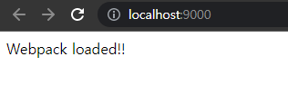

# Tutorials

웹팩의 4가지 속성에 대하여 간단한 실습


## Code Splitting

### 실습 절차

**1.&nbsp;빈 폴더에서 package.json 생성**

```shell
npm init -y
```

```json
// package.json
{
  "name": "codesplitter",
  "version": "1.0.0",
  "description": "",
  "main": "index.js",
  "scripts": {
    "test": "echo \"Error: no test specified\" && exit 1"
  },
  "keywords": [],
  "author": "",
  "license": "ISC"
}
```

**2.&nbsp;필요 라이브러리 설치 (devDependencies)**

* webpack
* webpack-cli
* css-loader
* style-loader
* mini-css-extract-plugin

```shell
npm i webpack webpack-cli css-loader style-loader mini-css-extract-plugin -D
```

**3.&nbsp;루트레벨에 index.html 추가**

```html
<!DOCTYPE html>
<html>
  <head>
    <meta charset="utf-8">
    <title>CSS & Libraries Code Splitting</title>
  </head>
  <body>
    <header>
      <h3>CSS Code Splitting</h3>
    </header>
    <div>
      <!-- 웹팩 빌드 결과물이 잘 로딩되면 아래 p 태그의 텍스트 색깔이 파란색으로 표시됨 -->
      <p>
        This text should be colored with blue after injecting CSS bundle
      </p>
    </div>
    <!-- 웹팩의 빌드 결과물을 로딩하는 스크립트 -->
    <script src="./dist/bundle.js"></script>
  </body>
</html>
```

**4.&nbsp;루트레벨에 base.css , index.js추가**

```css
// base.css
p {
  color : blue;
}
```

```js
// index.js
import './base.css'
```

**5.&nbsp;웹팩 설정 파일`webpack.config.js`추가**

```js
var path = require('path');

module.exports = {
  mode: 'none',
  entry: './index.js',
  output: {
    filename: 'bundle.js',
    path: path.resolve(__dirname, 'dist')
  },
  module: {
    rules: [
      {
        test: /\.css$/,
        use: ['style-loader', 'css-loader']
      }
    ]
  },
}
```

> ❗ `mode` 속성은 웹팩 버전 4 이상에서 추가된 속성 
>
> 웹팩으로 빌드할 때의 `development`, `production`, `none` 모드를 설정할 수 있습니다.
>
> 설정하지 않으면 production이 기본값으로 설정됨.
>
> 참고 : [mode](https://webpack.js.org/configuration/mode/#root)

**6.&nbsp;css 파일을 별도 분리하기 위해 MiniCssExtractPlugin 추가**

```js
// webpack.config.js
var path = require('path');
var MiniCssExtractPlugin = require("mini-css-extract-plugin");

module.exports = {
  mode: 'none',
  entry: './index.js',
  output: {
    filename: 'bundle.js',
    path: path.resolve(__dirname, 'dist')
  },
  module: {
    rules: [
      {
        test: /\.css$/,
        use: [
          { loader: MiniCssExtractPlugin.loader },
          "css-loader"
        ]
      }
    ]
  },
  plugins: [
    new MiniCssExtractPlugin()
  ],
}
```


## 웹팩 데브 서버

웹팩 데브서버로 빌드한 결과물이 파일 탐색기에서는 보이지 않지만, 정상적으로 애플리케이션에 로딩되어 돌아가는것에 주의

### 실습절차

**1.&nbsp;빈 폴더에서 package.json 생성**

```shell
npm init -y
```

**2.&nbsp;필요 라이브러리 설치 (devDependencies)**

* webpack
* webpack-cli
* webpack-dev-server
* html-webpack-plugin

```shell
npm i webpack webpack-cli webpack-dev-server html-webpack-plugin -D
```

**3.&nbsp;`scripts`속성에 커스텀 명령어 추가**

```js
// package.json
{
  // ...
  "scripts": {
    "dev": "webpack serve"
  },
}
```

**4.&nbsp;루트레벨에 index.html 추가**

```html
<!DOCTYPE html>
<html>
  <head>
    <meta charset="utf-8">
    <title>Webpack Dev Server</title>
  </head>
  <body>
    <!-- 빌드 결과물이 정상적으로 로딩되면 아래 div 태그의 텍스트가 변경됨 -->
    <div class="container">
      TBD..
    </div>
    <!-- HTML Webpack Plugin에 의해 웹팩 빌드 내용이 아래에 추가됨 -->
  </body>
</html>
```

**5.&nbsp;루트레벨에 index.js 추가**

```js
// index.js
var div = document.querySelector('.container');
div.innerText = 'Webpack loaded!!';
```

**6.&nbsp;빈 폴더에서 webpack.config.js 생성**

```js
var path = require('path');
var HtmlWebpackPlugin = require('html-webpack-plugin');

module.exports = {
  mode: 'none',
  entry: './index.js',
  output: {
    filename: 'bundle.js',
    path: path.resolve(__dirname, 'dist'),
  },
  devServer: {
    port: 9000,
  },
  plugins: [
    new HtmlWebpackPlugin({
      // index.html 템플릿을 기반으로 빌드 결과물을 추가해줌
      template: 'index.html',
    }),
  ],
};
```

**7.&nbsp;`npm run dev`로 웹팩 데브 서버 실행후 localhost:9000확인**


