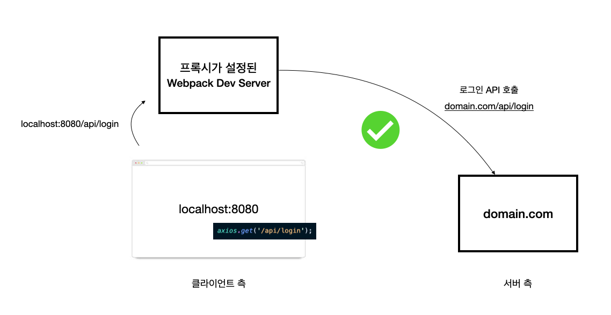
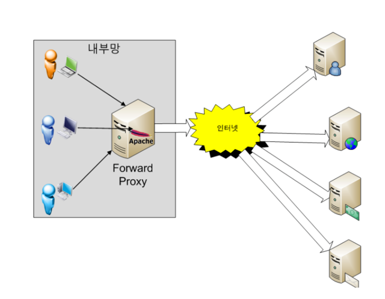

# Developer Tools

## Webpack Dev Server

웹팩 데브 서버는 웹 애플리케이션을 개발하는 과정에서 유용하게 쓰이는 도구

웹팩의 빌드 대상 파일이 변경되었을 때 매번 웹팩 명령어를 실행하지 않아도 코드만 변경하고, 저장하면 웹팩으로 빌드한 후 브라우저를 새로고침.


### 특징

웹팩 빌드와는 다르다.

```json
"scripts":{
    "dev": "webpack serve",
    "build": "webpack"
}
```

웹팩 데브 서버를 실행해 **웹팩 빌드를 하는 경우 결과물이 파일 탐색기나 프로젝트 폴더에서 보이지 않음**

웹팩 데브 서버로 빌드한 결과물은 **메모리에 저장**되고, 파일로는 생성되지 않아 컴퓨터 내부적으로는 접근되지만, 파일을 직접 조작 불가.

따라서, 개발이 완료되면 웹팩 명령어를 이용해 결과물을 파일로 생성해야함.

>  ❗ 메모리 입출력이 더 빠르고, 컴퓨터 자원을 덜 소모함.


## 프록시(Proxy) 설정

```js
// webpack.config.js
module.exports = {
    devServer: {
        proxy: {
            '/api': 'http://localhost:3000'
        }
    }
};
```

위 설정 후 로컬 웹팩 데브서버에서 발생하는 API 요청에 변화가 생김.

[CORS](https://developer.mozilla.org/en-US/docs/Web/HTTP/CORS)

다른 도메인간에는 자바스크립트로자원을 요청할 수 없다는 뜻

프록시 속성을 설정하면 서버에서 해당 요청을 받아줌.

```js
module.exports = {
  devServer: {
    proxy: {
      '/api': 'domain.com'
    }
  }
};
```



브라우저에서는 `localhost:8080/api/login`으로 요청했지만 중간에 프록시 서버가 `domian.com`서버에서는 같은 도메인에서 온 요청으로 인식하여 CORS에러가 나지않음.

> ❗ 도메인 이름이 IP주소가 아니라 가상의 도메인 이름(domain.com)인 경우 아래 옵션을 추가해야함.
>
> ```js
> module.exports = {
>   devServer: {
>     proxy: {
>       '/api': {
>         target: 'domain.com',
>         changeOrigin: true
>       }
>     }
>   }
> };
> ```


프록시란 두 점 사이에서 통신을 할 경우 그 사이에 있어 중계기로서 대리로 통신을 수행하는 기능, 즉 **중계기능을 을 하는 것**.

Client입장과 Server입장에서 볼 때 서로 상반되는 역할을 하는 것처럼 인식한다.<br/>(**클라이언트호스트 입장에서 보면 프록시서버는 원격서버처럼, 원격 서버입장에서는 클라이언트처럼 동작**한다.)

보안상의 이유도있지만 다른 장점들도 있다.

프록시 서버는 프록시서버에 요청된 내용들을 캐시를 이용해 저장해둠.<br/>캐시를 해두고 난 후 캐시 안에 있는 정보를 요구하는 요청에 대해서는 원격 서버에 접속해 데이터를 가져올 필요가 없게 됨으로써 **전송시간의 절약**을 할 수 있고, **불필요하게 외부와의 연결을 하지 않아도 된다.**<br/>**외부와의 트래픽을 줄이게 됨으로써 네트워크 병목 현상을 방지하는 효과도 있다.**

프록시서버는 서버의 위치에 따라 **Forward Proxy, Reverse Proxy**가 있다.

**Forward Proxy**

특정 사이트를 가려할 때, 가고싶은 목적지 사이트의 주소를 직접 프록시 서버에 전달해 프록시 서버가 해당 목적지 사이트의 내용을 받아와 전달해주는 개념.




**Reverse Proxy**

사용자가 Reverse Proxy로 설정된 서버의 주소로 데이터를 요청하게 되며, 프록시 서버가 이 요청을 받아 실제 내부 서버에서 데이터를 받아와 클라이언트에게 전달해주는 개념

직접 내부 서버에 서비스를 제공 받을 수 있지만, **보안** 때문

직접 서비스를 받게 되면 WAS가 털리게 되면, DB서버도 함께 털려 문제가 발생.

=> Reverse Proxy를 두고 실제 서비스는 내부에 위치시키고, 프록시 서버가 내부 서버와 통신을 해서 데이터를 받아오는 형식을 많이 사용함.

참고 :

https://brownbears.tistory.com/191

https://milkye.tistory.com/202